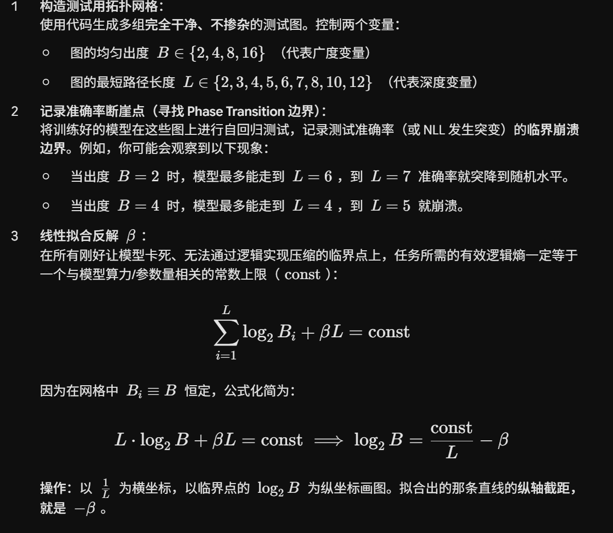

## 一、新的逻辑序列如何生成
- 定义分层拓扑架构：先控制变量，把每个节点对应出度统一。
    - 要生成一个深度为 $L$，各节点出度为 $B$ 的逻辑序列，将全图的 $V$ 个节点划分到 $L+1$ 个排好的层中（Layer $0$ 到 Layer $L$）。
    - **且Layer $0$ 仅包含起点 $s$；Layer $L$ 仅包含终点 $t$。**
- 严格控制出度连接：对于第 $i$ 层中的每一个节点：使用代码随机从第 $i+1$ 层中抽取 1 个节点作为正确后继（以此串联出通往终点 $t$ 的合法最短路径）。再从第 $i+1$ 层中随机抽取 $B-1$ 个节点作为干扰后继。
  - 好处是**根本不需要大批量生成后再去费时计算每条序列的 $H_G$ 均值或众数，它生成的瞬间，其拓扑逻辑熵就是绝对精确的 $L \cdot \log_2 B$。**
- 掺杂随机控制：在将图序列化为 Token 喂给模型时，我们可以引入一个配比常数 $\gamma$（逻辑序列与随机序列的比例）：当走逻辑路径时：文本严格按照上述 Layered DAG 打印：“边列表 $\mathcal{T}_{\text{edge}}$ + 起点 + 终点 $\rightarrow$ 正确路径序列”。
    - 当注入随机噪声时：保持前缀（问题部分）的图结构完全不变，但把目标答案序列（Answer 部分）替换成从词典 $V$ 中无视连通性、纯随机抽样出来的 Token 串。由于前缀相同而后缀逻辑断裂，这能完美迫使模型在此类数据上面对最大随机搜索熵 $H_R$。
  
## 二、β如何测定

## 三、可思考点（来自gemini 3.5flash）
### Q：之前的新定义提出不知道你还记不记得是有理论漏洞的，只是我们强行用现实猜想或者一些其他手段得出了β这个惩罚项，所以我认为很可能在Heff那个公式中得不到一个常量，因为根本和L不成线性关系。比如二次方，对数关系等等。这种情况下，我们的实验又该如何进行，论文应该如何发展才最有利辩证呢 
A: 一个比较好的思路如下：
- 阶段一：提出基准模型（线性玩具模型）叙事：首先严格按照有噪信道的乘性错误累积（Fano 不等式，$\sum p_i \le \epsilon$），在最朴素的一阶效应假设下，推导出包含线性惩罚项的 $\quad H_{\text{eff}} = \sum \log_2 B_i + \beta L \quad$。将它作为基准模型（Baseline）。
- 阶段二：实证撞墙与证伪（展现你的科学严谨性）叙事：通过二维拓扑网格实验测量临界崩溃边界。结果如你所料，发现反解出来的 $\beta$ 根本不是常数，而是随着深度 $L$ 的拉长而发生非线性退化。这证明了“大模型的长程隐式推理具有更复杂的物理加速溃败机制，一阶线性假设是不够的”。
- 阶段三：引入泛化非线性修正（论文的真正高潮与 Contribution）叙事：将公式升级为广义形式：$H_{\text{eff}} = \sum \log_2 B_i + f(L)$。通过实验数据，去拟合、摸索并寻找最契合大模型物理崩溃现象的 $f(L)$ 到底是什么形式（如多项式 $L^\alpha$、指数 $e^{\lambda L}$ 或对数 $\ln L$）。
#### 具体措施：
我们假设崩溃时模型的物理上限为一确定常数 $C_{\text{phys}}$，则临界点满足方程 $\quad L_{\text{crit}} \log_2 B + f(L_{\text{crit}}) = C_{\text{phys}}\quad$。我们开始对 $f(L)$ 进行三个方向的暴力试错拟合：
- 尝试一：验证多项式关系 $f(L) = \beta L^\alpha$（考验高阶错误累积）物理直觉：自回归中，前面走错会导致后面进错分支，噪声是滚雪球式的。如果不仅每步犯错，且后面的步更容易被前面的错带偏，惩罚项就会呈现超线性增长（$\alpha > 1$）。如何实验：公式变为 $L \log_2 B + \beta L^\alpha = C_{\text{phys}}$。你可以写一个简单的最小二乘法脚本，以 $\alpha$ 和 $\beta$ 为未知数进行网格搜索。如果发现某个 $\alpha \approx 2$（二次方关系）能让全图不同分支下的崩溃点完美收敛，你就证明了大模型的隐式推理面临着二次方加速遗忘惩罚。
- 尝试二：验证指数关系 $f(L) = \beta e^{\lambda L}$（考验功功亏一篑效应）物理直觉：对应不等错误保护加权形式，越往后走模型越脆弱，持仓成本呈指数级爆炸。如何实验：代入方程多组临界点，看 $(L, B)$ 的演变是否符合指数曲线。
- 尝试三：验证对数关系 $f(L) = \beta \ln L$（考验注意力饱和）物理直觉：Transformer 的注意力机制对长文本有一定的平滑容量，一开始增加步数惩罚很大，到后面反而边际效益递减。如何实验：同样进行回归。

### Q：我们想要提出的是一个通用推理深度连续定义模板，我认为在现实情况复杂系统下不可能所有节点都统一出度，那会不会被质疑不严谨和不具有泛化性？也就是说，现实中的图拓扑错综复杂，出度忽大忽小，实验里让所有节点出度完全统一，这种理论有什么泛化价值？
A：
#### 一、 为什么实验必须“固定出度”？（学术防御：控制变量法）
在科学研究中，要定量测量一个未知效应（如深度的非线性惩罚 $f(L)$），必须首先冻结所有其他变量。如果在实验中，图的节点出度 $B_i$ 忽大忽小，那么当模型在第 6 步崩溃时，你根本无法分清：模型是因为“这一步的分支太多（广度噪声墙）”被淹没的，还是因为“路径太长（深度疲劳）”而遗忘的。话术包装：固定出度 $B_i \equiv B$ 不是为了逃避现实，而是为了在各向同性（Isotropic）的理想拓扑信道中，实现对深度特征 $f(L)$ 的纯净纯化测量。这在物理学中就像是研究“无摩擦力表面”或“理想气体”，是建立普遍定律的必经基准（Baseline）。
#### 二、 如何将“扎实固定的实验”升华为“泛化的连续定义模板”？
为了证明你的连续定义模板能够外推到“节点出度不统一”的现实复杂系统，我们需要在数学表达上进行连续化扩展。原笔记本中的理想有效逻辑熵为：$$H_{\text{eff}} = \sum_{i=1}^{L} \log_2 B_i + f(L)$$面对现实中出度不均匀的复杂系统，我们可以提出以下两种极具学术说服力的泛化映射机制：
1. 理论泛化一：等效等概率出度（Geometric Mean Approximation）当大模型在一条真实的、出度多变的路径上生成时，信息论关注的是总搜索空间的膨胀率。假设一条实际路径上各节点的出度分别为 $B_1, B_2, \dots, B_L$。它们在原来的逻辑约束熵项中表现为 $\sum_{i=1}^L \log_2 B_i$。根据对数的性质，这一项可以重写为：$$\sum_{i=1}^{L} \log_2 B_i = \log_2 (B_1 \cdot B_2 \cdots B_L) = L \cdot \log_2 \bar{B}_{\text{geo}}$$其中，$\bar{B}_{\text{geo}} = (B_1 \cdot B_2 \cdots B_L)^{1/L}$ 是整条路径的几何平均出度。如何反驳质疑：你可以理直气壮地反驳，任何一个出度不均匀的复杂系统，在信息论尺度上，都等价于一个出度恒为 $\bar{B}_{\text{geo}}$ 的均匀拓扑系统。 我们通过固定出度测出来的 $f(L)$ 和 $\beta$，可以通过几何平均数直接无缝泛化套用到任何复杂的现实图结构中。
2. 理论泛化二：动态不等错误保护加权（UEP Non-uniform Weighting）如果想要表现得更严谨，我们可以直接和笔记 3.4 节的不等错误保护（UEP）结合。因为现实中，如果前几步出度很大（噪声大），模型可能立马就迷路了；如果最后一步出度大，影响可能较小。你可以推出通用模板的高级形式：$$H_{\text{eff}} = \sum_{i=1}^{L} w(i, L) \log_2 B_i$$在这个通用模板里，每一个节点的出度 $B_i$ 是独立的（不需要统一），而 $w(i, L)$ 是一个随位置动态变化的权重函数（它隐含了深度惩罚）。实验的价值：我们在受控实验中固定出度去拟合 $f(L)$，本质上是为了确定这个通用权重分布 $w(i, L)$ 的基础参数。一旦参数确定，这个公式对任何不规则的 $B_i$ 序列都天然通用。
